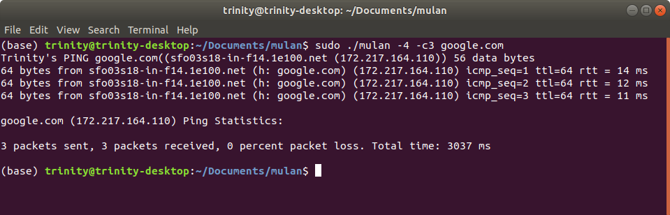

# mulan
## A CLI ping program for Linux by Trinity Lundgren



## Setup and Usage

System requirements: Linux, gcc 11+, GNU make

1.  Compile with command: `$ make`

2.  Run with `$ sudo ./mulan [OPTIONS] destination` where destination is a
    hostname or IP address. Note that root is required for mulan to send ICMP
    packets over a RAW socket.

3.  Remove object, executable and .zip file(s) with `$ make clean`

## Description

mulan sends a ping as an ICMP echo request to the specified destination.
Destination may be a URL, an IPv4 address or an IPv6 address. Peforms a forward
DNS lookup on the hostname and a reverse DNS lookup on the resulting IP address.

By default, the protocol used may be either IPv4 or IPv6 depending on the first
address returned for the hostname. mulan's default behavior is to ping the
provided destination in an infinite loop, interruptible with the command-line
input `^c`. Reports round trip times (rtt) for each ping and any packet loss.

Future plans for improvement include receiving and parsing "time exceeded" ICMP
packets and displaying feedback.

The name of this program is a tribute to the Chinese heroine Hua Mulan, whose
alias when disguised as a male soldier in the eponymous Disney film is Ping.

For questions contact trinity@trinitylundgren.com

## Command Line Options

Option | Argument | Description
------ | -------- | -----------
-h     |          | Show usage documentation and exit.
-4     |          | Use IPv4 only. Fails if hostname does not resolve to any IPv4 addresses.
-6     |          | Use IPv6 only. Fails if hostname does not resolve to any IPv6 addresses.
-c     | count    | Ping count times and exit.
-t     | ttl      | Set time-to-live for IPv4 or hop limit for IPv6.


## Example Usage

```
$ sudo ./mulan sprint.net

Trinity's PING sprint.net((www.sprint.net (2600::)) 56 data bytes
64 bytes from www.sprint.net (h: sprint.net) (2600::) icmp_seq=1 ttl=64 rtt = 80 ms
64 bytes from www.sprint.net (h: sprint.net) (2600::) icmp_seq=2 ttl=64 rtt = 85 ms
64 bytes from www.sprint.net (h: sprint.net) (2600::) icmp_seq=3 ttl=64 rtt = 81 ms
64 bytes from www.sprint.net (h: sprint.net) (2600::) icmp_seq=4 ttl=64 rtt = 80 ms
64 bytes from www.sprint.net (h: sprint.net) (2600::) icmp_seq=5 ttl=64 rtt = 80 ms
^C

sprint.net (2600::) Ping Statistics:

5 packets sent, 5 packets received, 0 percent packet loss. Total time: 4424 ms
```
